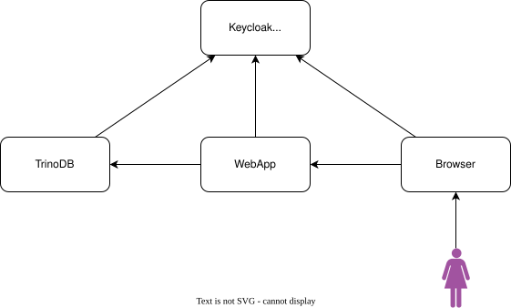
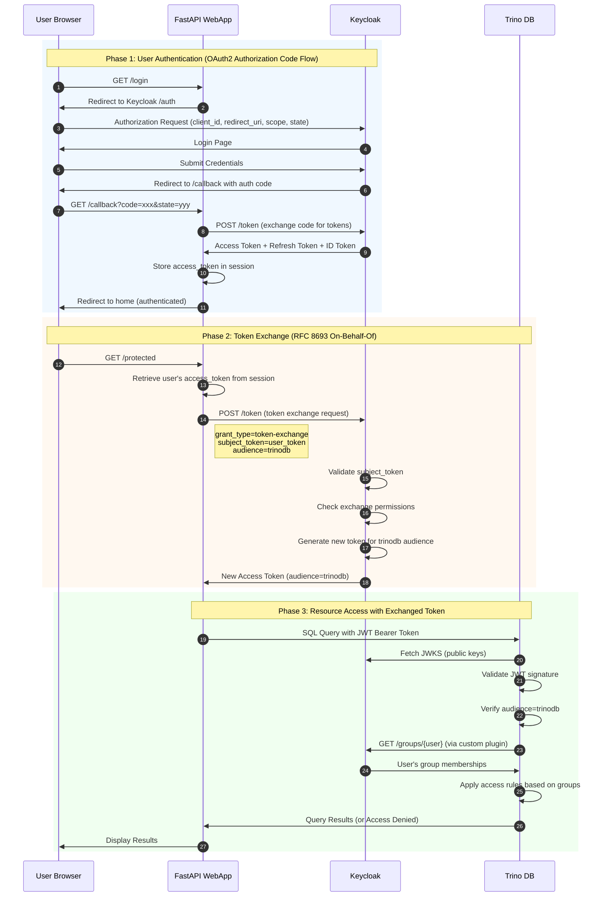

# Keycloak delegation demo

## Overview



This project demonstrates **OAuth2 Token Exchange (RFC 8693)** for secure delegation in a multi-service architecture. It solves a common enterprise problem: how can a web application query a backend service (like a database) **on behalf of an authenticated user** while preserving the user's identity and permissions?

### The Problem

In a typical setup where a web application needs to access a database:
- **Option A**: Use a shared service account - loses user identity, no per-user audit trail, overly broad permissions
- **Option B**: Pass the user's token directly - the token may not be authorized for the target service, violates audience restrictions

### The Solution

**Token Exchange** (On-Behalf-Of flow) allows the web application to exchange the user's token for a new token specifically scoped for the target service. The new token:
- Preserves the original user's identity (email, groups)
- Has the correct audience claim for the target service
- Can have restricted scopes appropriate for the specific use case

### What This Demo Shows

1. **User Authentication** - OAuth2 Authorization Code flow with Keycloak
2. **Token Exchange** - RFC 8693 token exchange to obtain Trino-specific tokens
3. **Group-Based Access Control** - Trino enforces permissions based on Keycloak group membership
4. **End-to-End Security** - Full audit trail from user login through database query

## Requirements

- docker compose
- mkcert
- uv

## 1. Certificates

First of all you need certificates and keys to start keycloak and trinodb with https.

To do so head to [certs/README.md](certs/README.md) and follow instructions.

## 2. Keycloak

Then you will start Keycloak and configure it. Docker compose takes care of it. Just run:

```
docker compose up --build
```

This will start at https://keycloak:8443 with administrator credentials `admin/admin`.

It will also run `pyscripts/src/main.py` to setup clients, scopes and users.

Our human users will be:

- `antonio.murgia@agilelab.it` / `StrongP@ssword123` (in trino-admins group)
- `andrea.fonti@agilelab.it` / `StrongP@ssword123`

The generated client secrets for webapp and trino will be written to env files inside `.env_files` folder.
Such files will be sourced by docker-compose in appropriate containers.

## 3. TrinoDB and webapp

Next step is to start our webapp and trinodb, we need to start them after initializing keycloak
so that they can be configured with the needed client secrets to connect to keycloak.

```
docker compose up --build webapp trinodb
```

## 4. Create views

In order to test that RBAC works correctly, we need to create a view that can be accessed by any
`andrea.fonti@agilelab.it` and one that can be accessed only by trino-admins.

Access control rules are controlled by `trino/rules.json` and `trino/catalog/hive-rules.json`

> N.B. For access control based on groups to work we need to add a custom plugin (not production ready)
> that is in [keycloak-groups-plugin](./keycloak-groups-plugin) and it is packaged with the custom trino
> image that we are using see [trino/container-image/Dockerfile](trino/container-image/Dockerfile)

```
cd pyscripts
uv run src/create_view.py
```

This will open a browser where you will need to login as antonio.murgia@agilelab.it (because it's a trino-admin),
andrea fonti will not work, it will return a permission denied error.

## 5. Performing On Behalf Of

Now the cool part:

- we're going to head to http://webapp:5555
- Click on Login with Keycloak
- log in with either antonio or andrea credentials
- Then click on "Protected Route"

If we logged as antonio the 6th element of the bullet point will show a list of nations

If we logged as andrea the 6th element of the bullet point will show a permission denied error (`Query failed`)

## Deep Dive: How It Works

This section explains the inner workings of the delegation demo, covering the OAuth2/OIDC flows, token exchange mechanism, and group-based access control.

### Architecture Overview

The demo consists of three main components:

1. **Keycloak** (Identity Provider) - Handles user authentication, issues tokens, and performs token exchange
2. **FastAPI Web App** (Intermediary) - Manages user sessions and orchestrates token exchange for backend services
3. **Trino** (Resource Server) - Validates JWT tokens and enforces group-based access control

### Authentication Flow

When a user clicks "Login with Keycloak", the standard OAuth2 Authorization Code flow is initiated:

1. **Authorization Request**: The webapp redirects the user to Keycloak's authorization endpoint with the required parameters (`client_id`, `redirect_uri`, `scope`, `state`)
2. **User Authentication**: The user authenticates with Keycloak (username/password)
3. **Authorization Code**: Keycloak redirects back to the webapp's `/callback` endpoint with an authorization code
4. **Token Exchange**: The webapp exchanges the authorization code for tokens (access token, refresh token, ID token)
5. **Session Storage**: The access token is stored in the user's session for subsequent requests

### Token Exchange (On-Behalf-Of Flow)

The core innovation in this demo is the **Token Exchange** mechanism defined in [RFC 8693](https://datatracker.ietf.org/doc/html/rfc8693). This allows the webapp to obtain a new token with a different audience (Trino) while preserving the original user's identity.

#### Why Token Exchange?

Without token exchange, the webapp would need to:
- Use its own service account credentials to query Trino (losing user identity)
- Pass the user's original token directly (which may not be authorized for Trino)

Token exchange solves this by allowing the webapp to request a new token **on behalf of** the authenticated user, specifically scoped for Trino.

#### Token Exchange Request

The webapp sends a POST request to Keycloak's token endpoint with:

```
grant_type=urn:ietf:params:oauth:grant-type:token-exchange
subject_token=<user's access token>
subject_token_type=urn:ietf:params:oauth:token-type:access_token
requested_token_type=urn:ietf:params:oauth:token-type:access_token
audience=trinodb
```

Keycloak validates:
1. The webapp client is authorized to perform token exchange
2. The subject token is valid
3. The target audience (trinodb) allows token exchange from the webapp client

If successful, Keycloak returns a new access token with:
- The original user's identity (email, groups, etc.)
- The audience claim set to `trinodb`
- Scopes appropriate for Trino access

### Sequence Diagram



### Group-Based Access Control

Trino uses a custom plugin (`keycloak-groups-plugin`) to fetch user group memberships from Keycloak at runtime. This enables fine-grained access control:

1. **JWT Validation**: Trino validates the incoming JWT token using Keycloak's JWKS endpoint
2. **Identity Extraction**: The user's email is extracted from the token's `email` claim
3. **Group Lookup**: The custom plugin queries Keycloak's Admin API for the user's groups
4. **Rule Evaluation**: Access rules in `trino/rules.json` are evaluated based on the user's groups

Example access rule:
- Users in `trino-admins` group can access `private.nation_view`
- Other users receive "Permission Denied"

### Key Configuration Points

| Component | Configuration | Purpose |
|-----------|--------------|---------|
| Keycloak | Token Exchange enabled on webapp client | Allows webapp to exchange tokens |
| Keycloak | `scope-token-exchange` scope | Required scope for token exchange |
| Trino | `jwt.required-audience=trinodb` | Validates audience claim in JWT |
| Trino | `jwt.principal-field=email` | Uses email as user identity |
| WebApp | `audience=trinodb` in exchange request | Requests token for Trino |

### Security Considerations

1. **Token Isolation**: The original user token is never sent directly to Trino; only the exchanged token with proper audience is used
2. **Audience Restriction**: Trino only accepts tokens specifically issued for it (`audience=trinodb`)
3. **Principle of Least Privilege**: The exchanged token can have reduced scopes compared to the original
4. **Audit Trail**: Keycloak logs both the original authentication and the token exchange, enabling full traceability

### TODO

- [ ] Remove all verify=False